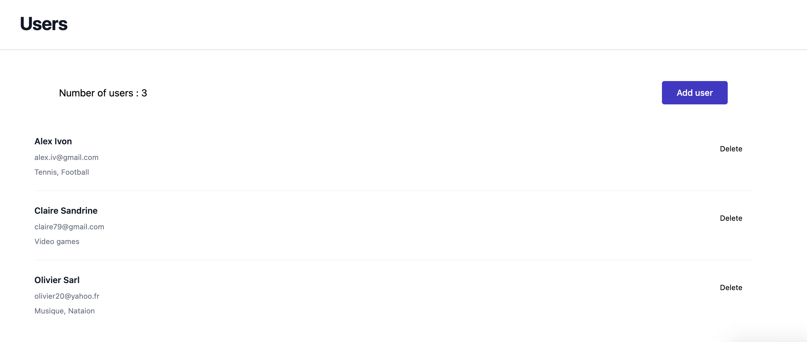

# Création d'une Infrastructure Docker pour une Application MERN

Dans ce projet, nous développons une application avec un frontend construit avec React et un backend utilisant Node.js et Express. L'objectif principal est de containeriser ces deux applications et de les déployer dans un environnement Docker unique, permettant ainsi aux différents conteneurs de communiquer efficacement entre eux. Les conteneurs à mettre en place sont les suivants :

- **react-app** : un conteneur dédié à l'application frontend construite avec React.
- **node-app** : un conteneur pour l'application backend développée avec Node.js et Express.
- **mongo + mongo-express** : un conteneur pour la base de données MongoDB, accompagné de Mongo-Express pour la gestion de l'interface utilisateur.

Ainsi, l'ensemble du système sera orchestré dans un environnement intégré, facilitant le développement, le déploiement et la gestion des services.

## Stack technique

- [Vite]("https://vitejs.dev")

- [React]("https://react.dev")

- [Tailwind CSS]("https://tailwindcss.com")

- [Docker]("https://www.docker.com")

- [Mongo]("https://www.mongodb.com")

- [Node.js]("https://nodejs.org")

- [Express.js]("https://expressjs.com")

## Explications générales :

### server.js

Définit une application Node.js avec Express qui interagit avec une base de données MongoDB. Deux routes sont disponibles:

- GET /users : récupère tous les utilisateurs de la base de données.
- POST /save : enregistre un nouvel utilisateur dans la base de données.

Le code utilise des middlewares comme body-parser pour gérer les requêtes HTTP et cors pour permettre les requêtes cross-origin.

### project-compose.yaml

Ce fichier décrit une configuration Docker Compose pour exécuter quatre services : une application Node.js, une application React, une base de données MongoDB, et Mongo Express pour l'administration de MongoDB. Les applications sont exécutées à l'aide de leurs images Docker respectives et communiquent entre elles via le réseau Docker. MongoDB utilise un volume pour la persistance des données.

### Dockerfile

Un Dockerfile est un script texte qui contient un ensemble d'instructions pour automatiser la création d'une image Docker.

Le rôle principal d'un Dockerfile est de définir l'environnement dans lequel une application s'exécute et de standardiser ce processus de création de l'environnement.

#### Pour l'application node js

`FROM node as build` : Utilisation d'une image Docker de Node basée sur Alpine Linux, qui est une distribution Linux légère et donc idéale pour minimiser la taille de l'image Docker.

`ENV MONGO_DB_USERNAME=admin \ MONGO_DB_PWD=password` : Définition de variables d'environnement pour les informations d'identification de la base de données MongoDB. Ces variables peuvent être utilisées plus tard dans l'application.

`WORKDIR /app` : Définition du répertoire de travail `/app` où les commandes suivantes seront exécutées.

`COPY . .` : Copie tous les fichiers et répertoires de l'application depuis le répertoire de contexte local vers le répertoire de travail dans l'image Docker.

`RUN npm install` : Exécution de la commande npm install pour installer toutes les dépendances listées dans package.json.

`CMD ["npm", "run", "dev"]` : Définition de la commande par défaut à exécuter lorsque le conteneur démarre, ici npm run dev pour démarrer l'application en mode développement.

#### Pour l'application react-app

1. Étape de Construction :

`FROM node as build` : Utilise une image Node.js légère basée sur Alpine Linux. La partie as build désigne cette étape comme une phase de "build" distincte.

`WORKDIR /app` : Définit le répertoire de travail à /app à l'intérieur du conteneur.

`COPY package.json ./* `: Copie package.json et package-lock.json dans le répertoire de travail.

`RUN npm install` : Installe les dépendances nécessaires à partir des fichiers package.

`COPY . .` : Copie tout le contenu du répertoire local dans le conteneur.

`RUN npm run build` : Exécute la commande pour construire l'application React en mode production.

2. Étape de Serveur de Production :

`FROM nginx` : Utilise une image Nginx légère basée sur Alpine Linux.

`COPY --from=build /app/dist /usr/share/nginx/html` : Copie les fichiers construits depuis l'étape précédente vers le répertoire racine de Nginx pour servir l'application.

`EXPOSE 80` : Expose le port 80 pour permettre l'accès à l'application via HTTP.

`CMD ["nginx", "-g", "daemon off;"]` : Commande pour démarrer Nginx en mode "foreground" pour que le conteneur reste en cours d'exécution.

## Push le conteneur docker dans le hub docker

Pour push les applications React et Node, il suffit d'exécuter la commande suivante :

```
./push-containers.sh
```

Le script push-containers.sh effectue les opérations suivantes :

- Naviguer vers le répertoire de l'application React et construire l'image Docker de l'application.
- Taguer l'image Docker pour le dépôt distant.
- Push l'image Docker React vers le dépôt distant.
- Naviguer vers le répertoire de l'application Node et construire l'image Docker de l'application.
- Taguer l'image Docker Node pour le dépôt distant.
- Pousser l'image Docker Node vers le dépôt distant.

Après en remplace le nom des images de react-app et node-app par l'index digest correspondant (exemple : sha296:7yyd07042996...)

## Démarrage du Projet

Pour démarrer la base de données MongoDB, exécutez la commande suivante :

```
docker-compose -f db-compose.yaml up
```

Ensuite, pour consulter la base de données, rendez-vous sur : http://localhost:8081

Après avoir démarré la base de données, lancez le projet avec la commande :

```
npm run start
```

Vous pouvez ensuite accéder à l'application React à l'adresse suivante : http://localhost:5173

## Lancement du Projet avec Docker

Pour démarrer le projet en utilisant Docker, il suffit d'exécuter la commande suivante :

```
./start-project.sh
```

Nb: La commande suivante permet de rendre le script 'start-project.sh' exécutable.

```
chmod +x start-project.sh
```

Le script start-project.sh effectue les opérations suivantes :

- Accède au répertoire de l'application React et crée une image Docker pour celle-ci.
- Accède au répertoire de l'application Node.js et crée une image Docker pour celle-ci.
- Démarre tous les services requis à l'aide de Docker Compose.

Vous pouvez ensuite accéder à l'application React à l'adresse suivante : http://localhost:5173

Ensuite, pour consulter la base de données, rendez-vous sur : http://localhost:8081

Avec cette méthode, vous pouvez facilement gérer et déployer votre projet avec Docker, en garantissant un environnement cohérent et reproductible.


